# Traverse

There are 8.3 billion people in the world today. They speak over 7,000 languages, live across 195 countries — and in 2025 alone, 1.5 billion of them crossed an international border.

But the world is getting harder to move through. Across the roughly 38,000 travel corridors worldwide, each has its own rules, its own required documents, and its own language. As many as one in four visa applications get refused — and the most common reasons are preventable. Incomplete forms. Missing documents. Contradictions the applicant never noticed.

**Traverse was built to fix that.**

Three AI agents review your visa application the way an experienced immigration team would. Traverse researches the travel requirements for any corridor, reads every document — in any of 40 languages — and tells you exactly what to fix before you submit. The Research, Document Intelligence, and Advisory agents coordinate to catch the errors that cause preventable rejections — across documents, across languages, for any corridor in the world.

Built for an Anthropic hackathon — showcasing extended thinking, web search, vision, and multi-agent coordination.

## Quick Start

1. Get an [Anthropic API key](https://console.anthropic.com/)
2. Clone and install: `npm install`
3. Add API key to `.env.local`
4. Run: `npm run dev`
5. Open http://localhost:3000
6. Click a demo persona in the sidebar or enter your own travel details

## Architecture

Traverse runs three AI agents on Claude Opus 4.6, coordinated by a TypeScript orchestrator that streams results to the UI in real-time via Server-Sent Events.


All three agents use **Claude Opus 4.6** with extended thinking — dynamically allocating reasoning depth based on complexity.

| Agent | Opus 4.6 Capabilities | What It Does |
|-------|----------------------|--------------|
| **Research** | Web Search, Extended Thinking | Searches live government sources for corridor-specific visa requirements |
| **Document Intelligence** | Vision, Extended Thinking | Reads documents in any language, cross-references for contradictions |
| **Advisory** | Extended Thinking, Structured Output | Synthesizes findings into prioritized, actionable fixes |

## Demo Walkthrough — Priya Sharma

The demo follows Priya, a software engineer in Bangalore applying for a business visa to Germany. Her nine documents contain a cross-lingual contradiction she doesn't know about.

```mermaid
graph TD
    subgraph SETUP["Setup"]
        S1["Open Sidebar"]
        S2["Select Priya Sharma"]
        S3["Load Profile<br/><i>India → Germany, Business</i>"]
        S4["Form Auto-fills<br/><i>animated field slide</i>"]
        S5["Click Check Requirements"]
        S1 --> S2 --> S3 --> S4 --> S5
    end

    subgraph RESEARCH["Phase 1: Research"]
        R1["Research Agent Activates<br/><i>cached india-germany.json</i>"]
        R2["Sources Found<br/><i>German Embassy, VFS Global</i>"]
        R3["12 Requirements Loaded<br/><i>9 uploadable, 3 info-only</i>"]
        R4["Phase 1 Advisory<br/><i>instant — no LLM</i>"]
        R1 --> R2 --> R3 --> R4
    end

    subgraph DOCS["Phase 2: Document Verification"]
        D1["Passport Uploaded"]
        D2["Auto-Cascade<br/><i>8 remaining docs, 300ms stagger</i>"]
        D3["9 Parallel Vision Reads<br/><i>Opus 4.6 + Vision</i>"]
        D4["9 Cross-Checks<br/><i>compliance per requirement</i>"]
        D1 --> D2 --> D3 --> D4
    end

    subgraph FINDINGS["Findings"]
        F1["CRITICAL<br/>Cross-lingual contradiction<br/><i>Hindi: permanent ₹85K<br/>English: contract ₹60K</i>"]
        F2["CRITICAL<br/>Gmail forensic flag<br/><i>easummit2026@gmail.com</i>"]
        F3["WARNING<br/>Narrative gap<br/><i>15-day trip, 3-day conference</i>"]
    end

    subgraph ADVISORY["Phase 3: Advisory"]
        A1["Phase 1b Updates<br/><i>advisory evolves in real-time</i>"]
        A2["Phase 2 LLM Synthesis<br/><i>Opus 4.6 + Extended Thinking</i>"]
        A3["Modal Opens<br/><i>Let's Strengthen Your Application</i>"]
        A1 --> A2 --> A3
    end

    subgraph REAUDIT["Phase 4: Re-Audit"]
        X1["Apply Fixes & Re-check"]
        X2["Fix 1: Cover Letter<br/><i>Corrected to match Hindi docs</i><br/>PASS"]
        X3["Fix 2: Invitation<br/><i>Official domain + letterhead</i><br/>PASS"]
        X4["Fix 3: Itinerary<br/><i>Day-by-day plan added</i><br/>PASS"]
        X5["Looking Good!<br/><i>APPLICATION PROCEEDS</i>"]
        X6["Switch to Hindi<br/><i>नमस्ते — modal translates</i>"]
        X1 --> X2 --> X3 --> X4 --> X5 --> X6
    end

    S5 --> R1
    R4 --> D1
    D4 --> F1
    D4 --> F2
    D4 --> F3
    D4 --> A1
    F1 & F2 & F3 --> A2
    A3 --> X1

    style SETUP fill:#f8fafc,stroke:#64748b,stroke-width:1px
    style RESEARCH fill:#eff6ff,stroke:#3b82f6,stroke-width:2px
    style DOCS fill:#f5f3ff,stroke:#8b5cf6,stroke-width:2px
    style FINDINGS fill:#fef2f2,stroke:#ef4444,stroke-width:2px
    style ADVISORY fill:#ecfdf5,stroke:#10b981,stroke-width:2px
    style REAUDIT fill:#f0fdf4,stroke:#16a34a,stroke-width:2px

    style F1 fill:#fee2e2,stroke:#dc2626
    style F2 fill:#fee2e2,stroke:#dc2626
    style F3 fill:#fef3c7,stroke:#d97706
    style X5 fill:#bbf7d0,stroke:#16a34a,stroke-width:2px
```



<details>
<summary><strong>SSE Event Flow (Technical Detail)</strong></summary>


</details>

## Key Features

- **🌍 Universal Coverage** — Works for any travel corridor (37,830+ combinations), any purpose (tourism, business, study, work, medical, family)
- **🗣️ 40 Languages** — Upload documents in any language; get results translated to your preferred language
- **🔍 Three-Phase Analysis** — Research → Document Intelligence → Advisory synthesis
- **⚡ Minimal Dead Time** — Two-phase advisory shows instant preliminary results, updates progressively, then refines with AI
- **🔒 Privacy-First** — No database, no accounts, documents processed in-memory and immediately discarded
- **🎨 Beautiful UX** — Dual themes, progressive translation, real-time AI reasoning display, smooth animations

## How It Works

### Phase 1: Research Agent (Opus 4.6 + Web Search + Extended Thinking)
- Searches live government sources for current visa requirements
- Uses extended thinking to reason about complex visa policies
- Returns structured checklist with requirement details, sources, fees, processing times
- Falls back to cached data for instant results if live search unavailable

### Phase 2: Document Intelligence Agent (Opus 4.6 + Vision + Extended Thinking)
- **Pass 1**: Reads all documents in parallel using multimodal vision
  - Extracts text from images in any language
  - Identifies document types (passport, bank statement, invitation letter, etc.)
  - Detects language and structured data
- **Pass 2**: Cross-document analysis with extended thinking
  - Checks compliance against requirements
  - Detects cross-lingual contradictions (e.g., employment status differs between languages)
  - Assesses narrative coherence (dates, amounts, story consistency)
  - Flags potential document forensics issues

### Phase 3: Advisory Agent (Two-Phase Architecture)
- **Phase 3a (Instant)**: Programmatic advisory built from requirements
  - Shows immediately while documents are analyzing
  - Lists all required documents and initial guidance
- **Phase 3b (Progressive)**: Updates as each document completes
  - Severity changes based on compliance (info → warning → critical)
  - Overall assessment evolves in real-time
- **Phase 3c (Refined)**: Opus 4.6 synthesis with extended thinking
  - Triggers after 80% of documents analyzed
  - Refines recommendations with specific, actionable guidance
  - Adds helpful URLs (embassy sites, government portals)
  - Generates personalized interview tips
  - Warm, encouraging tone: "Let's fix this" not "You must correct"

## Tech Stack

### Frontend
- **Next.js 16.1.6** (App Router)
- **React 19.2.3**
- **TypeScript 5**
- **Tailwind CSS 4** + shadcn/ui components
- Server-Sent Events (SSE) for real-time streaming

### Backend
- **Anthropic SDK 0.74.0** (`claude-opus-4-6`)
  - Extended thinking (16K token budget)
  - Web search (Research Agent)
  - Vision (Document Intelligence Agent)
  - Streaming responses
- **Node.js** runtime
- **Zod** for runtime validation
- In-memory rate limiting
- Environment variable validation

### Infrastructure
- **Vercel** deployment
- No database — stateless, privacy-first architecture
- Edge-compatible API routes

## Demo Personas

Try one of three pre-built demo personas with realistic document sets:

| Persona | Corridor | Purpose | Documents | Key Issues |
|---------|----------|---------|-----------|------------|
| **Priya Sharma** | India → Germany | Business (tech conference) | 9 docs (Hindi + English) | Cross-lingual employment contradiction, low savings ratio |
| **Amara Okafor** | Nigeria → UK | Study (MSc) | 8 docs (English) | Standard student visa requirements |
| **Carlos Mendes** | Brazil → Japan | Tourism (photography) | 6 docs (Portuguese + English) | Freelance income documentation |

Click the personas in the sidebar to auto-load their profiles and documents.

## Getting Started

### Prerequisites
- Node.js 18+ and npm
- Anthropic API key ([get one here](https://console.anthropic.com/))

### Installation

```bash
# Clone the repository
git clone <repository-url>
cd clearpath

# Install dependencies
npm install

# Set up environment variables
# Create a new .env.local file
touch .env.local
```

Edit `.env.local` and add your Anthropic API key:
```env
ANTHROPIC_API_KEY=sk-ant-api03-...
```

### Running Locally

```bash
npm run dev
```

Open [http://localhost:3000](http://localhost:3000) in your browser.

### Building for Production

```bash
npm run build
npm start
```

## Environment Variables

| Variable | Required | Default | Description |
|----------|----------|---------|-------------|
| `ANTHROPIC_API_KEY` | Yes | - | Your Anthropic API key |
| `ANTHROPIC_MODEL` | No | `claude-opus-4-6` | Model for Research & Document agents |
| `ADVISORY_MODEL` | No | `claude-opus-4-6` | Model for Advisory agent |
| `USE_LIVE_SEARCH` | No | `false` | Enable live web search (otherwise uses cached data) |
| `NODE_ENV` | No | `development` | Environment (development/production) |

## Security & Production Features

### Security
- **Environment Validation** — Runtime validation of required environment variables with clear error messages
- **API Key Protection** — Never committed to version control, validated on startup
- **Rate Limiting** — In-memory rate limiter protects all API endpoints:
  - `/api/analyze`: 10 requests/minute (STRICT)
  - `/api/translate`: 30 requests/minute (STANDARD)
  - `/api/advisory`: 30 requests/minute (STANDARD)
- **Type Safety** — Full TypeScript with Zod runtime validation for all inputs
- **Error Handling** — Comprehensive error boundaries and graceful degradation

### Development
- **Development-Only Logging** — Console statements gated with `isDevelopment()` checks
- **No Console Pollution in Production** — Clean production builds
- **Type Guards** — Proper type guards instead of `as any` assertions
- **Named Constants** — All magic numbers extracted to configuration

## Privacy

- **No database.** No user data stored anywhere.
- **No accounts.** No login, no signup, no tracking cookies.
- **In-memory only.** Documents are base64-encoded in the browser, sent to the API route, processed, and immediately discarded.
- **No server-side file storage.** All processing happens in memory during the request.
- **No tracking.** No analytics, no third-party scripts, no cookies.

## Demo Documents

The `demo-docs/` directory contains synthetic documents for demonstration purposes:
- 26 realistic document templates (HTML)
- Rendered to PNG using Puppeteer
- All data is completely fictional — no real PII anywhere
- Documents in multiple languages (Hindi, Portuguese, English)
- Intentional flaws for demonstration (contradictions, low amounts, etc.)

## Project Structure

```
clearpath/
├── src/
│   ├── app/                      # Next.js App Router
│   │   ├── page.tsx             # Landing page with travel form
│   │   ├── analyze/page.tsx     # Analysis page with live results
│   │   └── api/                 # API routes
│   │       ├── analyze/route.ts # Main orchestrator (SSE)
│   │       ├── advisory/route.ts # Phase 2 advisory (SSE)
│   │       └── translate/route.ts # Translation endpoint
│   ├── lib/                      # Core logic
│   │   ├── agents/              # AI agent implementations
│   │   │   ├── research.ts      # Research Agent (Opus 4.6 + Web Search)
│   │   │   ├── document.ts      # Document Intelligence Agent (Opus 4.6 + Vision)
│   │   │   └── advisory.ts      # Advisory Agent (Opus 4.6 + Thinking)
│   │   ├── advisory-builder.ts  # Phase 1 & 1b programmatic advisory
│   │   ├── env.ts               # Environment validation
│   │   ├── rate-limit.ts        # Rate limiting middleware
│   │   ├── validation.ts        # Zod schemas
│   │   ├── types.ts             # TypeScript types
│   │   ├── config.ts            # Configuration constants
│   │   ├── i18n-context.tsx     # Translation system
│   │   └── demo-context.tsx     # Demo persona state
│   └── components/              # React components (19 files)
│       ├── advisory-modal.tsx   # Refined advisory modal
│       ├── advisory-card.tsx    # Progressive advisory card
│       ├── live-feed.tsx        # SSE event renderer
│       ├── thinking-panel.tsx   # Real AI reasoning display
│       └── ...
├── demo-docs/                   # Synthetic demo documents
│   ├── templates/               # HTML templates
│   └── personas/                # Rendered PNGs
└── data/                        # Cached fallback data
    └── corridors/               # Pre-researched visa requirements
```

## Development

### Key Scripts
```bash
npm run dev          # Start development server
npm run build        # Build for production
npm run start        # Run production build
npm run lint         # Run ESLint
```


## Built With Opus 4.6

This project showcases Claude Opus 4.6 capabilities:
- **Extended Thinking** (16K budget) — All three agents reason through complex visa policies
- **Web Search** — Research Agent searches live government sources
- **Vision** — Document Intelligence Agent reads documents in any language
- **Multi-Agent Coordination** — TypeScript orchestrator manages three specialized agents
- **Streaming** — Real-time SSE streams show thinking and results as they happen

Built for an Anthropic hackathon.

## Troubleshooting

### "ANTHROPIC_API_KEY is not set"
- Make sure you created `.env.local` (not `.env`)
- Check that the API key starts with `sk-ant-`
- Restart the dev server after adding the key

### "Rate limit exceeded"
- Development mode bypasses rate limits
- Production limits: 10 req/min for analysis, 30 req/min for translation
- Wait for the retry-after period shown in the error

### Documents not uploading
- Max file size: 5MB per file
- Supported formats: PNG, JPEG only
- Max 12 files total
- Check browser console for errors

### Translation not working
- Ensure language selector shows current language
- Translation happens in 3 phases (UI → Content → Live Feed)
- Check network tab for `/api/translate` requests
- English is default, no translation needed

### Extended thinking not showing
- Thinking panels appear during analysis (collapsible)
- Look for the eye icon "View AI reasoning" on each requirement
- Thinking text shows in real-time during processing
- Check that `ANTHROPIC_MODEL=claude-opus-4-6` in `.env.local`


## Acknowledgments

- Built with [Claude Opus 4.6](https://www.anthropic.com/claude) by Anthropic
- UI components from [shadcn/ui](https://ui.shadcn.com/)
- Icons from [Lucide](https://lucide.dev/)
- Inspired by the millions of visa applicants worldwide who face preventable rejections

## License

MIT
